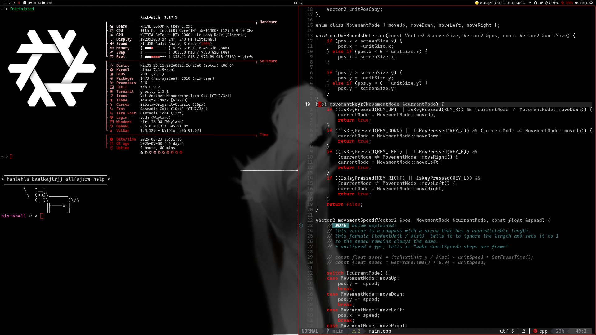
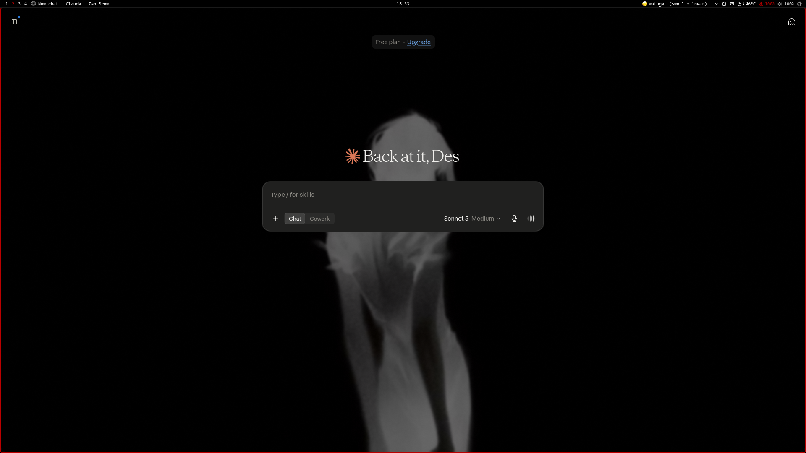
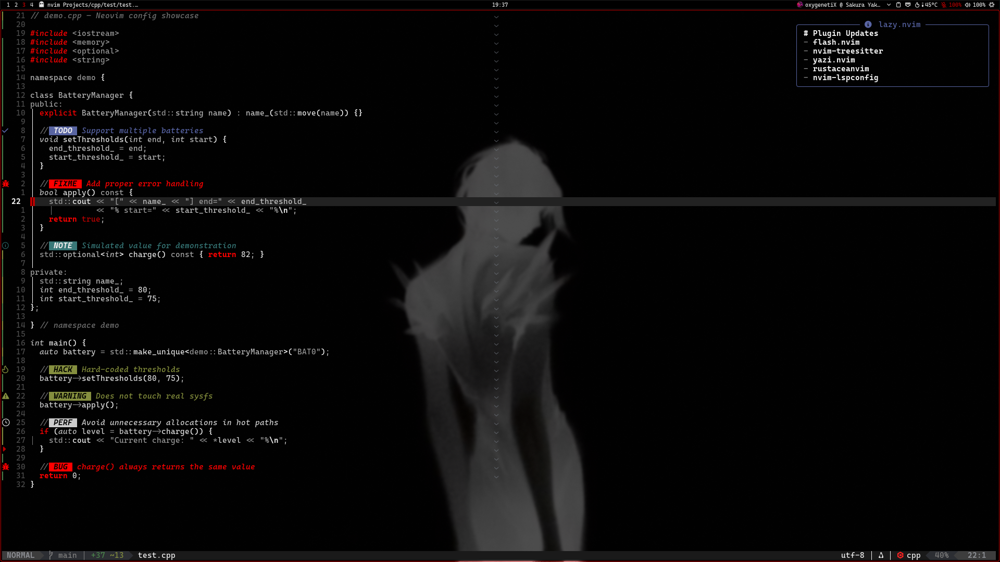
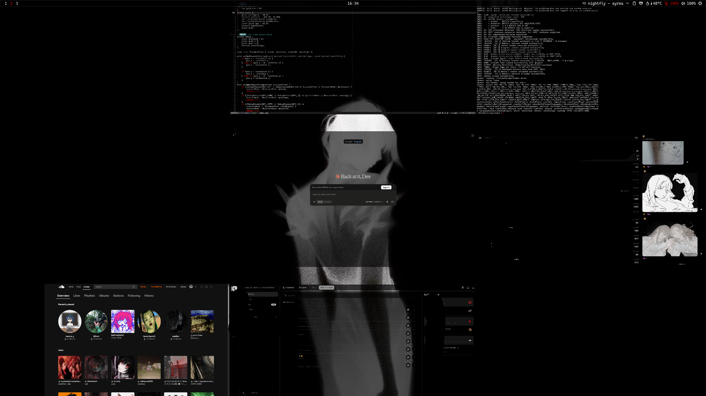
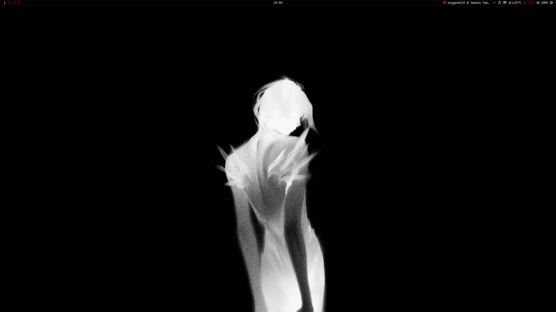
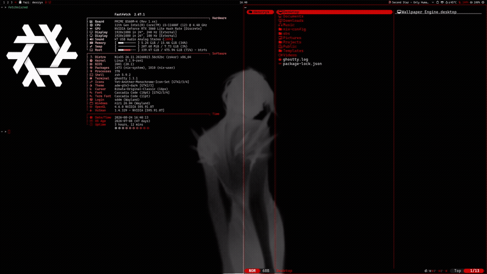

# nix-config

> **This is a NixOS personal config, assembled with LLM assistance.

---

## Screenshots

---

## Features

A quick tour of what's inside: 

- **Noctalia v5** - Various plugins, keymap cheatsheet accessible via `mod + F1`. Note, telemetry is enabled for noctalia
- **Font** - Cascadia Code
- **Neovim** - LazyVim base with a custom colorscheme.
- **Syncthing** - Auto-syncs `Pictures` and `Videos` between machines.
- **Terminal** - Ghostty
- **File manager** - Yazi
- **Browser** - Zen
- **Notes** - Obsidian

> Note
- **Vesktop**: Small things configured eg. plugins, themes, etc.
- **Wayscriber**: Cool whiteboard.
- **EasyEffects**: EQ that may not suit you.
- Various other things... idk

- **Noctalia toml**: The `noctalia-config.toml` contains personal wallpaper paths, thumbnail cache, and plugin settings.

---

**Username:** `descryx` | **Shell:** Zsh | **Compositor:** Niri

| Device | Hostname | Hardware | Config |
|--------|----------|----------|--------|
| Desktop | `desk` | NVIDIA + Intel desktop | `hosts/desk/` |
| Laptop  | `t480` | ThinkPad T480 (Intel) | `hosts/t480/` |

## [Structure](structure.md)
> Normal dotfiles are used! See .

### Required edits
- `hosts/*/default.nix`        → Change `hostName`, add/remove host-specific modules
- `hosts/*/wallpapers-*.nix`   → Replace Syncthing device IDs.
- `modules/users.nix`          → Change username, home directory
- `modules/boot.nix`           → Update to your CPU/GPU if Plymouth needs changes
- `modules/networking.nix`     → Edit if needed
- `modules/nix-settings.nix`   → Remove/keep Cachix key, change trusted-users
- `home.nix`                   → Change username
- `configuration.nix`          → Enable/disable modules as needed
- `dotfiles/.../noctalia/noctalia-config.toml` → Replace wallpaper paths etc. (probably through the gui)

### Files you'll likely want to remove
- `hosts/desk/` and `hosts/t480/`
- `modules/graphics.nix`
- `modules/openrgb.nix`

---

## Syncthing setup

Syncthing is configured (in `hosts/*/wallpapers-*.nix`) to automatically sync `Pictures` and `Videos` between two machines. After setting up:

1. Fill in the device IDs (run `syncthing device-id` on each machine)
2. Rename the device keys in `/hosts/*/wallpapers-*.nix` (e.g., `your-desktop`, `your-laptop`) to match your preferences
3. Rebuild. Both machines will discover each other and start syncing. Prolly.

---

## About this config

- It assumes NixOS unstable, specific hardware (NVIDIA desktop, Intel T480), and opinionated software choices.
- **Use it as reference and inspiration.**

MIT Licence covers only the nix config!
Not the assets.

## Credits

- [fastfetch pic](https://x.com/maoxianxiaotao/status/2033224745957929219)
- [fastfetch based on this](https://www.reddit.com/r/NixOS/comments/1tt2qww/fastfetchconfig/)
- [sddm wallpapers](https://x.com/zhamaooooooo/status/1970472008111853611)
- [Wayscriber](https://github.com/devmobasa/wayscriber)
- [Syncting](https://syncthing.net/)
- [Niri Animations](https://github.com/jgarza9788/niri-animation-collection)
